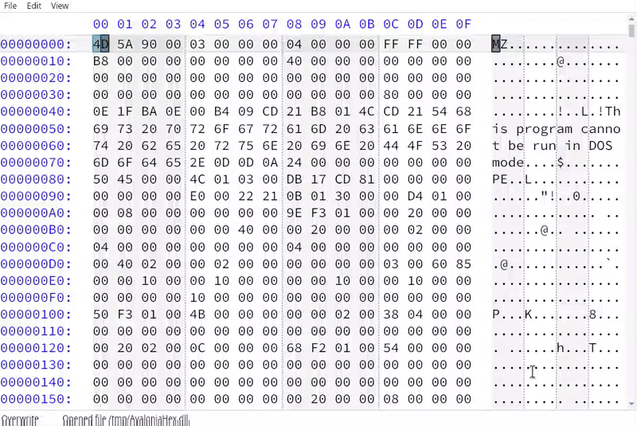

# AvaloniaHex

This is a(n experimental) hex editor control for the [Avalonia](https://github.com/AvaloniaUI/Avalonia) UI framework.




## Features

- Display binary data in hex, binary and ASCII.
- Adjust the displayed bytes per line manually or automatically.
- Modify binary documents in-place.
- Many style customization options available with default Light and Dark themes.
- Custom byte ranges highlighting.


## Quick Start Guide

After installing the `AvaloniaHex` dependency, add the default control styles to your `App.axaml`:

```xml
<Application xmlns="https://github.com/avaloniaui" ... >
    <Application.Styles>
        ...
        <StyleInclude Source="avares://AvaloniaHex/Themes/Simple/AvaloniaHex.axaml"/>
    </Application.Styles>
</Application>
```

Then, add the `HexEditor` control to your window:

```xml
<Window
    xmlns:avaloniaHex="clr-namespace:AvaloniaHex;assembly=AvaloniaHex"
    xmlns:rendering="clr-namespace:AvaloniaHex.Rendering;assembly=AvaloniaHex"
    ...>
    
    <avaloniaHex:HexEditor FontFamily="Cascadia Code,JetBrains Mono,Monospace,monospace">
        <!-- Define columns to display -->
        <avaloniaHex:HexEditor.Columns>
            <rendering:OffsetColumn />
            <rendering:HexColumn />
            <rendering:AsciiColumn />
        </avaloniaHex:HexEditor.Columns>
    </avaloniaHex:HexEditor>

</Window>
```

See [examples](examples) for more details.


## License

MIT